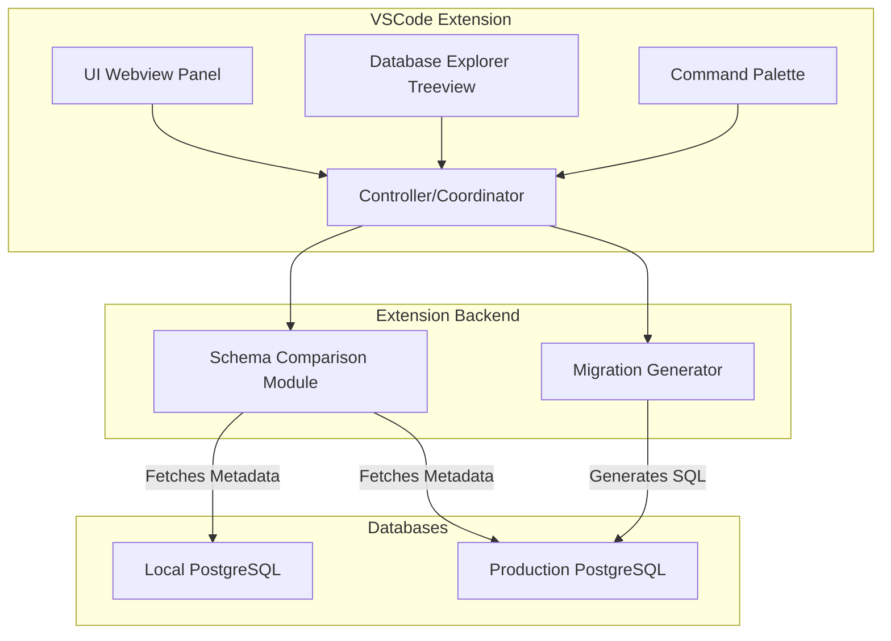

# PostgreSQL Schema Compare & Sync

**PostgreSQL schema management in VSCode**

[](https://marketplace.visualstudio.com/vscode)
[](LICENSE)

## 🚀 Quick Overview

Manage PostgreSQL schemas without leaving VSCode. Visual schema comparison, migration generation, and database browsing - all in one seamless workflow.

### 🎯 Key Benefits

- **10x Faster**: Connection pooling and caching for instant operations
- **Zero Context Switching**: Everything you need stays within VSCode
- **Enterprise Ready**: Auto-recovery, rollback support, and comprehensive error handling
- **Team Collaboration**: Visual diff tools and shared migration scripts

### 👥 Who It's For

- **Developers**: Manage schemas alongside code development
- **DevOps Teams**: Streamline database deployments
- **DBAs**: Visual schema comparison and migration planning

### 💼 Common Use Cases

| Scenario | Benefit | Solution |
|----------|---------|----------|
| **Schema Migration** | 80% faster deployments | Automated SQL generation |
| **Multi-Environment** | Eliminate drift | Visual comparison across envs |
| **Code-Schema Sync** | Prevent integration issues | Real-time schema browsing |

## Features

### 🔗 Database Connections
- **Multi-Environment Support:** Manage connections across local, dev, staging, and production
- **Secure Storage:** Encrypted credential storage using VSCode's Secret Storage API
- **Connection Health:** Auto-recovery from network interruptions and health monitoring
- **Connection Pooling:** Advanced pooling for optimal performance

### 🌳 Visual Database Explorer
- **Activity Bar Integration:** Dedicated PostgreSQL icon in VSCode's sidebar
- **Tree Navigation:** Browse all database objects in an intuitive hierarchical view
- **Object Support:** Tables, views, functions, procedures, sequences, indexes, constraints
- **Quick Actions:** Right-click context menus for all database operations

### ⚖️ Schema Comparison
- **Visual Diff Engine:** Color-coded differences with syntax highlighting
- **Flexible Modes:** Choose between strict and intelligent comparison algorithms
- **Selective Analysis:** Compare full schemas or specific objects
- **Background Processing:** Non-blocking operations with caching

### 🔄 Migration & Sync
- **Safe Deployments:** Dry-run mode and SQL preview before execution
- **Selective Sync:** Choose exactly which changes to apply
- **Rollback Support:** Automatic rollback script generation
- **Progress Tracking:** Real-time migration monitoring

### 📊 Object Details
- **Rich Metadata:** View columns, constraints, indexes, and dependencies
- **Source Code:** Function and procedure source with syntax highlighting
- **Sample Data:** Table data preview for context
- **Dependencies:** Visual relationship and foreign key analysis

---

## Architecture

### ASCII Diagram

```
                +----------------------------+
                |   VSCode Extension UI      |
                |  (Webview, Treeview)       |
                +-------------+--------------+
                              |
                              |
                +-------------V---------------+
                |  Extension Backend          |
                |  (TypeScript/Node.js)       |
                |  - Controller/Coordinator   |
                |  - Schema Compare Module    |
                |  - Migration Generator      |
                +-------------+---------------+
                              |
                +--+----------V--------+------+
                |                             |
                v                             v
            +------------+          +----------------+
            |   Local    |          |   Production   |
            | Postgres   |          |   Postgres     |
            +------------+          +----------------+
```



### 🚀 Performance-Optimized Architecture

**Connection Management:**
- **Advanced Connection Pooling:** Reuses database connections for optimal performance (10x faster operations)
- **Health Monitoring:** Proactive connection health checks with automatic recovery from network interruptions
- **Auto-Reconnection:** Seamless recovery from network issues and database server restarts

**Schema Processing:**
- **Intelligent Caching:** Background schema refresh with smart invalidation reduces database roundtrips
- **Parallel Processing:** Multi-threaded schema extraction and comparison for large databases
- **Streaming Results:** Efficient handling of large datasets without memory issues

**Migration Engine:**
- **Non-Blocking Operations:** Background processing with progress indicators keeps UI responsive
- **Rollback Support:** Automatic rollback script generation for all migrations
- **Batch Optimization:** Transaction-safe batch operations for maximum efficiency

---

## Installation & Usage

**Install:** Get from VSCode Marketplace

**Quick Start:**
1. Click PostgreSQL icon in Activity Bar
2. Add connection: host, port, database, credentials
3. Browse schemas in tree view
4. Compare: Right-click → Compare Schemas
5. Migrate: Preview and execute changes

**Commands:** Use Command Palette (`Ctrl+Shift+P`) for all operations

## Development

**Prerequisites:** Node.js 22.0+, PostgreSQL 12+

**Setup:**
```bash
git clone https://github.com/yourusername/postgres-schema-sync.git
cd postgres-schema-sync
pnpm install
pnpm run build
```

**Code Quality:**
- **Linting & Formatting:** Uses Biome.js for fast, comprehensive code quality checks
- **TypeScript:** Strict type checking with JSX support
- **Build Process:** Integrated linting and formatting in CI/CD pipeline

**Project Structure:** VSCode extension (TypeScript) with comprehensive testing

## Contributing

**Contribute:** Fork the repository, create a feature branch, add tests, and submit a pull request.

**Areas:** Database objects, performance, cloud integration, UI improvements

## Security

**Secure:** Encrypted credentials, confirmation dialogs, audit trails

## License

MIT License - see [LICENSE](LICENSE) file
